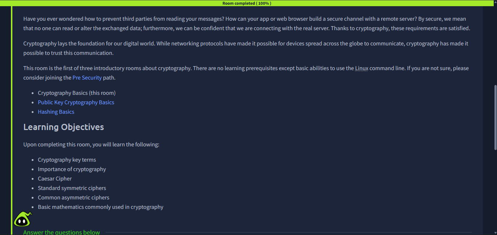
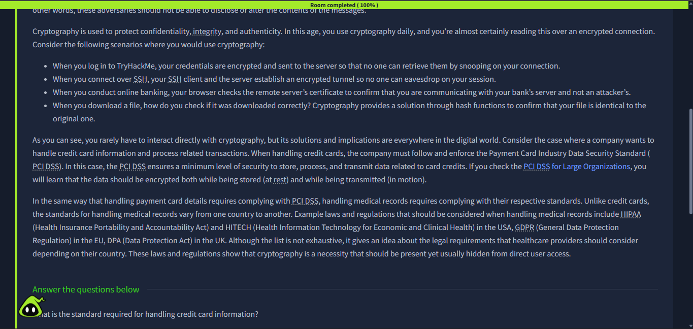
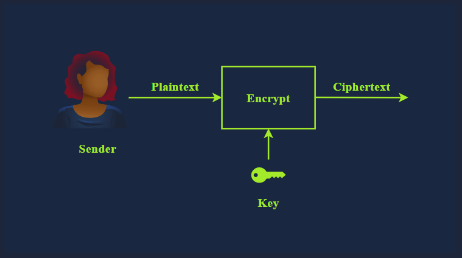
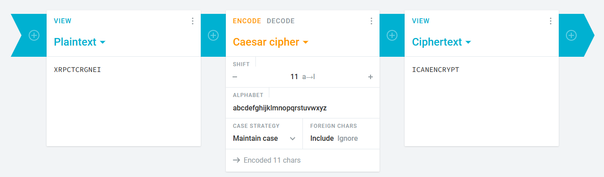
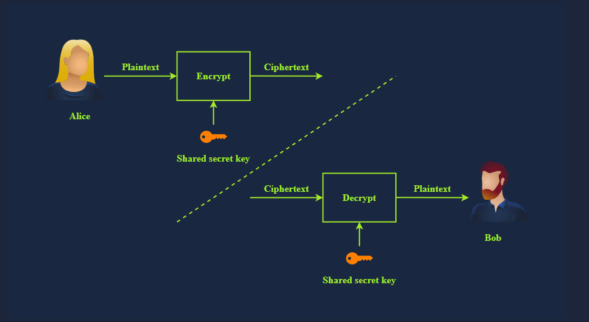
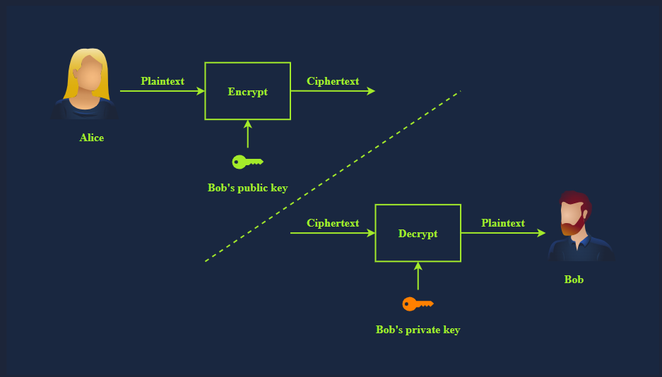
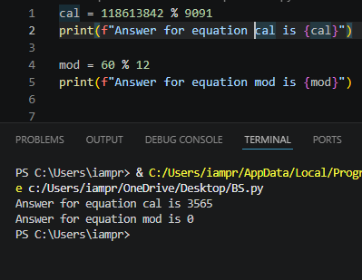
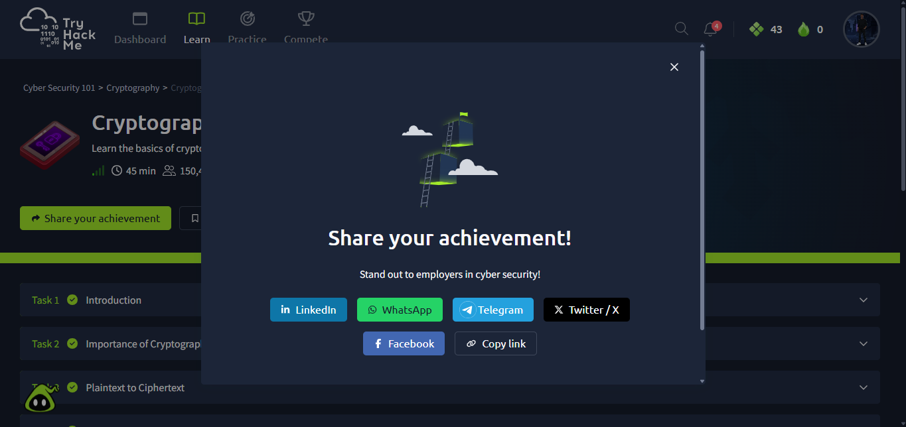

# 🔐 Cryptography Basics

> **Room:** [Cryptography Basics](https://tryhackme.com/room/cryptographybasics)  
> **Difficulty:** Easy  
> **Pathway:** Cybersecurity 101  
> **Date Completed:** 23/6/2026  
> **Module:** Cryptography

---

## 📚 Learning Objectives

By the end of this room, I aimed to understand:
- [x] What cryptography is and why it's essential for cybersecurity
- [x] Key terminology: plaintext, ciphertext, encryption, decryption, cipher, key
- [x] The difference between encoding and encryption
- [x] Historical ciphers (Caesar Cipher)
- [x] Symmetric vs. asymmetric encryption
- [x] Basic cryptographic math (XOR and modulo operations)
- [x] Common encryption standards: DES, AES, RSA
- [x] How cryptography protects data in transit and at rest

---

## 🧠 Theory & Key Concepts

### What is Cryptography?
Cryptography is the practice and study of techniques for securing communication and data in the presence of adversaries. It ensures:
- **Confidentiality :** Only authorized parties can read the data
- **Integrity :** Data has not been tampered with
- **Authenticity :** Verifying the identity of communicating parties

### Key Terminology

| Term | Definition                                                               |
|------|--------------------------------------------------------------------------|
| **Plaintext** | The original, readable, unencrypted data                                 |
| **Ciphertext** | The encrypted, scrambled version of plaintext                            |
| **Encryption** | The process of converting plaintext to ciphertext                        |
| **Decryption** | The process of converting ciphertext back to plaintext                   |
| **Cipher** | An algorithm used to perform encryption/decryption                       |
| **Key** | A piece of information required to encrypt/decrypt data                  |
| **Encoding** | Representing data in a different format (e.g., Base64, Hex) [NOT secure] |
| **Brute Force Attack** | Trying every possible key until the correct one is found                 |
| **Cryptanalysis** | Breaking encryption by analyzing patterns/weaknesses in the cipher       |

### Encoding vs. Encryption
| Encoding | Encryption |
|----------|------------|
| No key required | Requires a key |
| Easily reversible | Computationally difficult to reverse without the key |
| Not meant for security | Designed for security |
| Examples: Base64, Hex | Examples: AES, RSA |

### Why Cryptography Matters in Cybersecurity
| Scenario | How Cryptography Helps |
|----------|------------------------|
| **Online Banking** | Encrypts transactions so attackers can't steal card details |
| **Web Browsing (HTTPS)** | SSL/TLS certificates verify you're connecting to the real website |
| **SSH Remote Access** | Encrypts commands and data sent to remote servers |
| **Data Storage** | Encrypts sensitive data at rest (PCI-DSS requirement) |
| **Password Storage** | Hashing (a one-way form of encryption) protects stored passwords |

> ⚠️ **Important:** Passwords should be **hashed**, not encrypted. Encryption is reversible (requires a key), but hashing is one-way. If you encrypted passwords, you'd need to store the decryption key somewhere — which could be stolen.

---

## 🖥️ Practical Walkthrough

### Task 1: Introduction

**Objective:** Get familiar with the room's learning goals.

**What I Did:**
- Read the room introduction and learning objectives
- Confirmed I understood the prerequisites

**Screenshot:**
> 
> *Overview of the Cryptography Basics room learning path*

**Key Takeaway:** This room is the first of three cryptography rooms in the Cybersecurity 101 pathway. It focuses on symmetric encryption basics before moving to public-key cryptography and hashing in later rooms.

---

### Task 2: Importance of Cryptography

**Objective:** Understand why cryptography is critical for modern security.

**What I Did:**
- Reviewed real-world use cases where cryptography protects data
- Understood that standards like **PCI DSS** require encryption for credit card data
- Learned that cryptography ensures confidentiality, integrity, and authenticity

**Key Concepts:**
- **PCI DSS (Payment Card Industry Data Security Standard)** — The standard required for handling credit card information. It mandates encryption both at rest (in storage) and in transit (while being sent over a network).
- **HTTPS** — Uses SSL/TLS certificates to encrypt web traffic and verify server identity
- **SSH (Secure Shell)** — Replaces insecure protocols like Telnet by encrypting remote connections

**Screenshot:**
> 
> *Understanding the importance of PCI DSS compliance for payment data*

**Key Takeaway:** Cryptography is everywhere — from your online banking to your SSH sessions. Without it, sensitive data would be exposed to anyone intercepting network traffic.

---

### Task 3: Plaintext to Ciphertext

**Objective:** Understand the fundamental process of encryption and decryption.

**What I Did:**
- Learned the definitions of plaintext and ciphertext
- Understood that encryption transforms readable data into unreadable data
- Understood that decryption reverses the process

**Visual Representation:**
```
Plaintext  --[Encryption + Key]-->  Ciphertext
Ciphertext --[Decryption + Key]-->  Plaintext
```

**Key Terms Mastered:**
| Term | Meaning |
|------|---------|
| **Plaintext** | Human-readable, original data |
| **Ciphertext** | Encrypted, scrambled output |
| **Encryption** | Process that converts plaintext to ciphertext |
| **Decryption** | Process that converts ciphertext back to plaintext |

**Screenshot:**
> 
> *Visualizing the encryption and decryption process*

**Key Takeaway:** The same key (in symmetric encryption) is used for both encryption and decryption. The security of the system depends on keeping the key secret.

---

### Task 4: Historical Ciphers

**Objective:** Learn about early encryption methods and their weaknesses.

**What I Did:**
- Studied the **Caesar Cipher** — one of the oldest and simplest encryption techniques
- Understood how it works: each letter in the plaintext is shifted by a fixed number of positions in the alphabet
- Decrypted the challenge: `XRPCTCRGNEI` using Caesar Cipher

**Caesar Cipher Example:**
```
Shift of 3:
A -> D, B -> E, C -> F, ... X -> A, Y -> B, Z -> C

Plaintext:  HELLO
Ciphertext: KHOOR
```

**Decrypting the Challenge:**
The ciphertext `XRPCTCRGNEI` was encrypted with a Caesar shift. By trying different shift values (or analyzing letter frequency), the original plaintext is revealed as:

```
XRPCTCRGNEI  --(Caesar shift)-->  ICANENCRYPT
```

**Screenshot:**
> 
> *Decoding the Caesar cipher challenge in the room*

**Key Takeaway:** Historical ciphers like Caesar are easily broken today because:
1. There are only 25 possible shifts (brute force is trivial)
2. They don't use a secret key — the algorithm itself is the only secret
3. Letter frequency analysis quickly reveals the pattern

Modern encryption uses complex mathematical operations and long keys to prevent these attacks.

---

### Task 5: Types of Encryption

**Objective:** Understand the difference between symmetric and asymmetric encryption.

**What I Did:**
- Compared symmetric vs. asymmetric encryption
- Learned about DES and AES as symmetric algorithms
- Understood why DES is no longer trusted
- Confirmed AES was adopted as the encryption standard in 2001

#### Symmetric Encryption
- Uses the **same key** for both encryption and decryption
- Faster than asymmetric encryption
- Key lengths typically 56–256 bits
- Examples: **DES**, **AES**

```
Alice --[Shared Secret Key]--> Encrypts --> Bob
Bob   --[Shared Secret Key]--> Decrypts --> Reads message
```

#### Asymmetric Encryption
- Uses a **key pair**: public key (for encryption) and private key (for decryption)
- Slower than symmetric encryption
- Key lengths typically 2048–4096 bits
- Examples: **RSA**, **Elliptic Curve Cryptography (ECC)**

```
Alice --[Bob's Public Key]--> Encrypts --> Bob
Bob   --[Bob's Private Key]--> Decrypts --> Reads message
```

**DES vs. AES Comparison:**

| Feature | DES | AES |
|---------|-----|-----|
| Key Length | 56 bits | 128, 192, or 256 bits |
| Block Size | 64 bits | 128 bits |
| Security | ❌ Broken/Weak | ✅ Secure |
| Adoption | 1977 | **2001** |
| Trust | **Nay** — don't trust it | Yea — industry standard |

**Screenshot:**
> 
> 
> *Comparing symmetric and asymmetric encryption with their use cases*

**Key Takeaway:**
- **Never trust DES** — its 56-bit key is too short and can be brute-forced in hours
- **AES (Advanced Encryption Standard)** replaced DES in 2001 and is still secure today
- Symmetric encryption is faster but requires secure key distribution
- Asymmetric encryption solves the key distribution problem but is slower

---

### Task 6: Basic Math

**Objective:** Learn the mathematical foundations of cryptography: XOR and modulo.

**What I Did:**
- Practiced **XOR (Exclusive OR)** bitwise operations
- Practiced **modulo** operations (remainder after division)
- Solved the challenge questions

#### XOR (⊕) Operation
XOR compares two bits and returns:
- `1` if the bits are **different**
- `0` if the bits are the **same**

| A | B | A ⊕ B |
|---|---|-------|
| 0 | 0 | 0 |
| 0 | 1 | 1 |
| 1 | 0 | 1 |
| 1 | 1 | 0 |

**Challenge: `1001 ⊕ 1010`**
```
  1001
⊕ 1010
  ----
  0011
```
- Position 1: 1 ⊕ 1 = 0
- Position 2: 0 ⊕ 0 = 0
- Position 3: 0 ⊕ 1 = 1
- Position 4: 1 ⊕ 0 = 1

**Result: `0011`**

#### Modulo (%) Operation
Modulo returns the **remainder** after division.

**Challenge 1: `118613842 % 9091`**
```
118613842 ÷ 9091 = 13047 remainder 3565
```
**Result: `3565`**

**Challenge 2: `60 % 12`**
```
60 ÷ 12 = 5 remainder 0
```
**Result: `0`**

**Screenshot:**
> 
> *Working through the XOR and modulo operations*

**Key Takeaway:** XOR and modulo are the building blocks of modern encryption. XOR is used in stream ciphers and one-time pads. Modulo is essential for RSA and Diffie-Hellman key exchange. Understanding these operations is crucial for anyone working in cryptography or CTFs.

---

### Task 7: Summary

**Objective:** Review all key concepts before moving to the next room.

**What I Did:**
- Reviewed all terminology: plaintext, ciphertext, encryption, decryption, cipher, key
- Confirmed understanding of symmetric vs. asymmetric encryption
- Noted the importance of AES over DES
- Documented the mathematical foundations (XOR, modulo)


**Key Takeaway:** This room built a solid foundation in cryptography basics. The next rooms in the pathway will cover:
1. **Public Key Cryptography Basics** — RSA, Diffie-Hellman, SSH, SSL/TLS, PGP/GPG
2. **Hashing Basics** — One-way functions, password hashing, integrity verification

---

## 🏁 Room Completion

**Status:** ✅ Completed  

**Screenshot:**
> 
> *Proof of room completion from TryHackMe*

---

## 💡 Key Takeaways & Lessons Learned

1. **Cryptography is the foundation of all digital security** — without it, passwords, banking, and private messages would be exposed.

2. **Encoding ≠ Encryption** — Base64 and Hex are encoding schemes (easily reversible, no key needed). Encryption requires a key and is designed to be secure.

3. **Historical ciphers teach us what NOT to do** — Caesar cipher's weakness (only 25 possible shifts) shows why modern encryption needs long, random keys.

4. **Symmetric encryption is fast but has a key distribution problem** — how do you securely share the secret key? This is why asymmetric encryption was invented.

5. **DES is dead — trust AES** — DES's 56-bit key was broken in 1999. AES with 256-bit keys is the current gold standard.

6. **Math is the backbone of crypto** — XOR and modulo operations appear in nearly every modern encryption algorithm. Mastering them helps in CTFs and understanding how encryption works under the hood.

7. **PCI DSS mandates encryption** — if you handle payment card data, you MUST encrypt it both at rest and in transit. This is a legal and compliance requirement.

---

## 🔗 Additional Resources

- [TryHackMe Cryptography Basics Room](https://tryhackme.com/room/cryptographybasics)
- [TryHackMe Public Key Cryptography Basics (Next Room)](https://tryhackme.com/room/publickeycryptographybasics)
- [TryHackMe Hashing Basics (Next Room)](https://tryhackme.com/room/hashingbasics)
- [AES Encryption Standard (NIST)](https://csrc.nist.gov/publications/detail/fips/197/final)
- [Caesar Cipher Explained (Khan Academy)](https://www.khanacademy.org/computing/computer-science/cryptography/crypt/v/caesar-cipher)
- [XOR Cipher Wikipedia](https://en.wikipedia.org/wiki/XOR_cipher)
- [Modulo Operation in Cryptography](https://www.khanacademy.org/computing/computer-science/cryptography/modarithmetic/a/what-is-modular-arithmetic)

---

*Write-up by: Precious Ajibola*  
*Date: 23/6/2026*  
*Next Room: Public Key Cryptography Basics*
