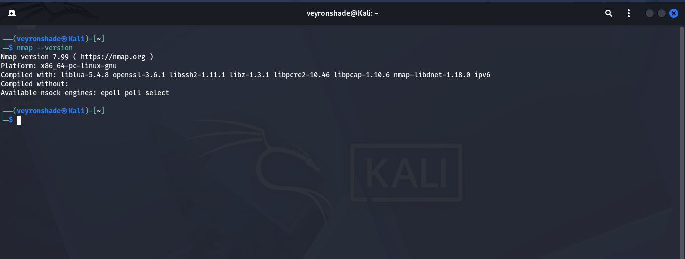
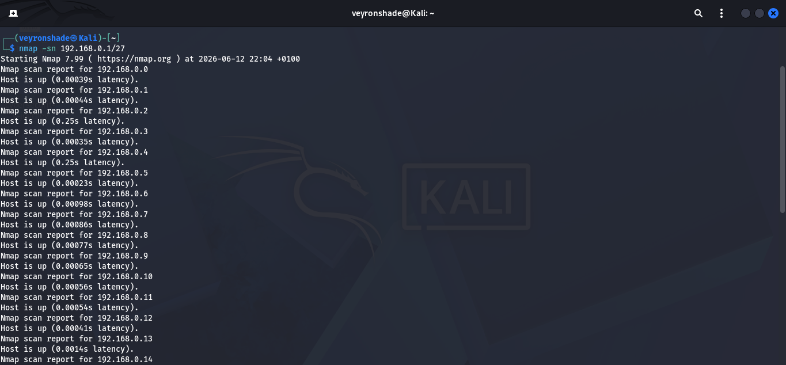
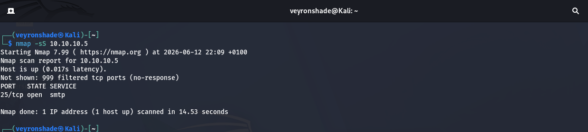
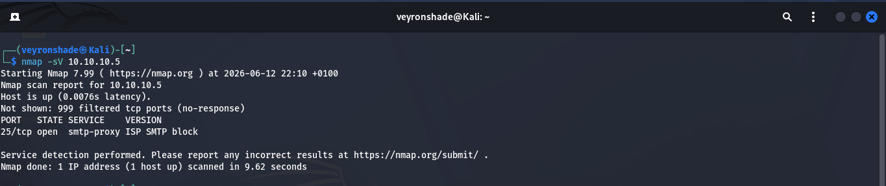
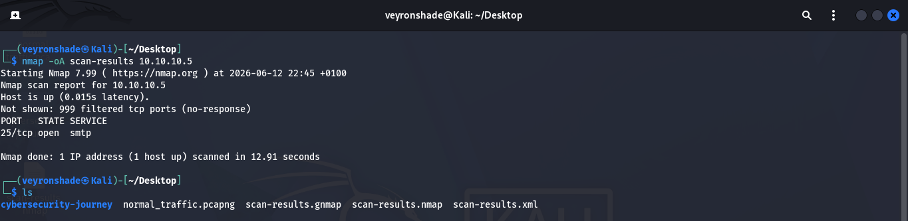
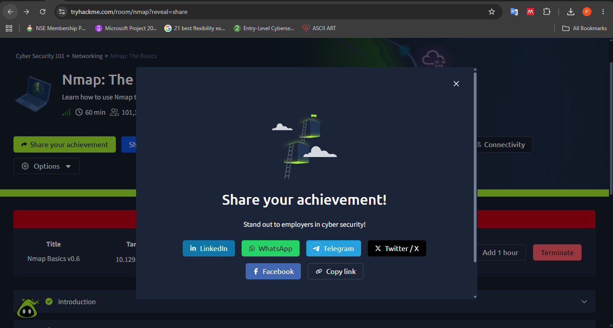

# 🔍Nmap — The Network Mapper

> **Room:** Nmap: The Basics  
> **Difficulty:** Easy  
> **Pathway:** Cybersecurity 101  
> **Date Completed:** 12/6/2026  
> **Category:** Networking
---

## 📚 Learning Objectives

By the end of this room, I aimed to understand:
- [x] What Nmap is and why it's essential for cybersecurity
- [x] Basic Nmap syntax and command structure
- [x] Different types of Nmap scans (TCP SYN, TCP Connect, UDP, etc.)
- [x] How to discover live hosts on a network
- [x] How to scan for open ports and identify services
- [x] How to use Nmap's scripting engine (NSE) for advanced enumeration
- [x] How to save and export scan results

---

## 🧠 Theory & Key Concepts

### What is Nmap?
Nmap (Network Mapper) is a free, open-source tool for network discovery and security auditing. It is used for:
- Discovering hosts and services on a computer network
- Creating a "map" of the network
- Identifying open ports, running services, OS versions etc

### Why Nmap Matters in Cybersecurity
| Role | Use Case                                            |
|------|-----------------------------------------------------|
| **Penetration Tester** | Reconnaissance (mapping target infrastructure)      |
| **SOC Analyst** | Baseline network auditing (knowing what's "normal") |
| **Network Admin** | Inventory management and vulnerability checks       |
| **Bug Bounty Hunter** | Scope verification and service enumeration          |

### Common Scan Types

| Scan Type | Flag | Description | Use Case                     |
|-----------|------|-------------|------------------------------|
| TCP SYN Scan | `-sS` | Stealth scan, doesn't complete handshake | Default, fast, stealthy      |
| TCP Connect Scan | `-sT` | Completes full TCP handshake | When SYN scan isn't possible |
| UDP Scan | `-sU` | Scans UDP ports | Finding DNS, DHCP, NTP, etc. |
| ACK Scan | `-sA` | Sends ACK packets | Firewall/ACL mapping         |
| OS Detection | `-O` | Attempts to identify target OS | Reconnaissance               |
| Service Version | `-sV` | Probes services for version info | Vulnerability mapping        |
| Aggressive Scan | `-A` | Enables OS detection, version detection, script scanning, and traceroute | Comprehensive scan           |

---

## 🖥️ Practical Walkthrough

### Task 1: Introduction to Nmap

**Objective:** Understand what Nmap is and install it.

**What I Did:**
- Read the room introduction
- Verified Nmap installation on my Kali VM:

```bash
nmap --version
```

**Screenshot:**
> 
> *Confirming Nmap is installed and ready to use*

**Key Takeaway:** Nmap comes pre-installed on Kali Linux. For other systems, it can be downloaded from [nmap.org](https://nmap.org).

---

### Task 2: Basic Scanning Commands

**Objective:** Learn fundamental Nmap commands and syntax.

**What I Did:**

1. **Basic ping scan** to discover live hosts:
```bash
nmap -sn 10.10.10.0/24
```
- `-sn`: Ping scan (host discovery only, no port scan)

2. **Scan a single target for open ports:**
```bash
nmap 10.10.10.5
```

3. **Scan multiple targets:**
```bash
nmap 10.10.10.5 10.10.10.6
```

4. **Scan a range of IPs:**
```bash
nmap 10.10.10.1-50
```

5. **Scan from a file:**
```bash
nmap -iL targets.txt
```

**Screenshot:**
> 
> *Output showing discovered hosts and their status*

**Key Takeaway:** Nmap's default scan checks the top 1000 most common TCP ports. Always start with a ping scan (`-sn`) to map the network before deep scanning.

---

### Task 3: Port Scanning Techniques

**Objective:** Understand different port scan types and when to use them.

**What I Did:**

1. **TCP SYN Scan (Stealth Scan):**
```bash
sudo nmap -sS 10.10.10.5
```
- Requires root/sudo privileges
- Doesn't complete the TCP handshake (stealthier)

2. **TCP Connect Scan:**
```bash
nmap -sT 10.10.10.5
```
- Completes full 3-way handshake
- Used when raw packets can't be sent (non-root users)

3. **UDP Scan:**
```bash
sudo nmap -sU 10.10.10.5
```
- Slower than TCP scans because UDP is connectionless
- Important for services like DNS (53), SNMP (161), DHCP (67/68)

4. **Scan specific ports:**
```bash
nmap -p 22,80,443 10.10.10.5
nmap -p 1-1000 10.10.10.5
nmap -p- 10.10.10.5        # Scan ALL 65535 ports
```

5. **Scan top ports:**
```bash
nmap --top-ports 100 10.10.10.5
```

**Screenshot:**
> 
> *Results of a stealth SYN scan showing open ports*

**Key Takeaway:** `-sS` is the default when running as root. UDP scans (`-sU`) are significantly slower — be patient or target specific ports.

---

### Task 4: Service and Version Detection

**Objective:** Identify what services are running and their versions.

**What I Did:**

1. **Basic service detection:**
```bash
nmap -sV 10.10.10.5
```
- `-sV`: Probe open ports to determine service/version info

2. **Aggressive detection (OS + Version + Scripts + Traceroute):**
```bash
sudo nmap -A 10.10.10.5
```

3. **OS Detection:**
```bash
sudo nmap -O 10.10.10.5
```

4. **Combining flags:**
```bash
sudo nmap -sS -sV -O -p- 10.10.10.5
```

**Screenshot:**
> 
> *Nmap identifying ISP SMTP block*

**Key Takeaway:** Version detection (`-sV`) is crucial for vulnerability assessment. Knowing the exact service version allows you to search for known CVEs.

---

### Task 5: Timing and Performance

**Objective:** Understand timing templates and optimize scan speed.

**What I Did:**

1. **Timing templates (T0 to T5):**
```bash
nmap -T4 10.10.10.5       # Aggressive timing (default is T3)
nmap -T5 10.10.10.5       # Insane speed (may miss results)
nmap -T2 10.10.10.5       # Polite (slower, less intrusive)
nmap -T0 10.10.10.5       # Paranoid (IDS evasion)
```

2. **Limit parallel scans:**
```bash
nmap --max-parallelism 10 10.10.10.5
```

3. **Host timeout:**
```bash
nmap --host-timeout 30s 10.10.10.0/24
```

**Key Takeaway:** `-T4` is generally safe for CTFs and labs. `-T0` and `-T1` are for IDS evasion but are extremely slow.

---

### Task 6: Saving and Output Formats

**Objective:** Learn how to save scan results in different formats.

**What I Did:**

1. **Normal output (human-readable):**
```bash
nmap -oN scan-results.txt 10.10.10.5
```

2. **XML output (for parsing/importing):**
```bash
nmap -oX scan-results.xml 10.10.10.5
```

3. **Grepable output (for filtering):**
```bash
nmap -oG scan-results.gnmap 10.10.10.5
```

4. **All formats at once:**
```bash
nmap -oA scan-results 10.10.10.5
```
- Creates `.nmap`, `.xml`, and `.gnmap` files

5. **Append to existing file:**
```bash
nmap -oN scan-results.txt --append-output 10.10.10.6
```

**Screenshot:**
> 
> *Directory listing showing all three output formats*

**Key Takeaway:** Always save your scans with `-oA` (all formats). XML can be imported into tools like Metasploit; grepable format is great for `grep`/`awk` processing.

---

## 🏁 Room Completion & Flag

**Status:** ✅ Completed  
**Final Flag:** `THM{...}` *(Redacted — Please, complete the room yourself!)*

**Screenshot:**
> 
> *Proof of room completion from TryHackMe*

---

## 📝 Commands Reference

### Essential Nmap Commands

```bash
# Host Discovery
nmap -sn 192.168.1.0/24                    # Ping sweep
nmap -Pn 10.10.10.5                        # Skip host discovery (treat all as up)

# Port Scanning
nmap -p 22,80,443 target                   # Specific ports
nmap -p 1-65535 target                     # All ports
nmap -p- target                            # All ports (shorthand)
nmap --top-ports 100 target                # Top 100 common ports

# Scan Types
sudo nmap -sS target                       # SYN (stealth) scan
nmap -sT target                            # TCP connect scan
sudo nmap -sU target                       # UDP scan
sudo nmap -sA target                       # ACK scan

# Service & OS Detection
nmap -sV target                            # Version detection
sudo nmap -O target                        # OS detection
sudo nmap -A target                        # Aggressive (OS + version + scripts + traceroute)

# NSE Scripts
nmap -sC target                            # Default scripts
nmap --script=vuln target                  # Vulnerability scripts
nmap --script=http-* target                # All HTTP scripts

# Output
nmap -oN file.txt target                   # Normal output
nmap -oX file.xml target                   # XML output
nmap -oG file.gnmap target                 # Grepable output
nmap -oA basename target                   # All three formats

# Performance
nmap -T4 target                            # Aggressive timing
nmap --max-retries 1 target                # Reduce retries
nmap --host-timeout 5m target              # Timeout per host


```

---

## 💡 Key Takeaways & Lessons Learned

1. **Nmap is the Swiss Army knife of network scanning** — mastering it is non-negotiable for any cybersecurity role.

2. **Always start broad, then go deep** — use ping sweeps (`-sn`) to find live hosts, then target specific hosts with detailed scans.

3. **Save everything** — use `-oA` to preserve results in multiple formats for reporting and future reference.

4. **Be patient with UDP** — UDP scans take significantly longer than TCP scans due to the connectionless nature of the protocol.

5. **Know your timing** — `-T4` is my go-to for labs, but understand when to slow down (`-T2`) or speed up (`-T5`).

6. **Permission is paramount** — never scan networks you don't own or have explicit written permission to test.

---

## 🔗 Additional Resources

- [Nmap Official Documentation](https://nmap.org/book/)
- [Nmap Cheat Sheet](https://www.stationx.net/nmap-cheat-sheet/)
- [TryHackMe Nmap Room](https://tryhackme.com/room/nmap)

---

*Write-up by: [Precious Ajibola]*  
*Date: [12/6/2025]*  
*Next Room: [Cryptography]*

