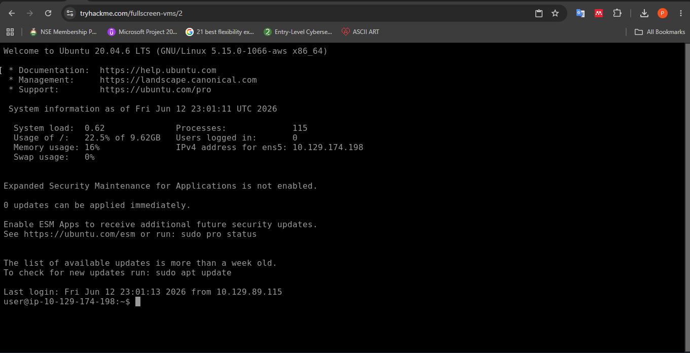
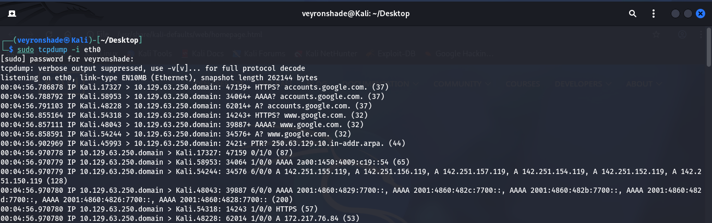
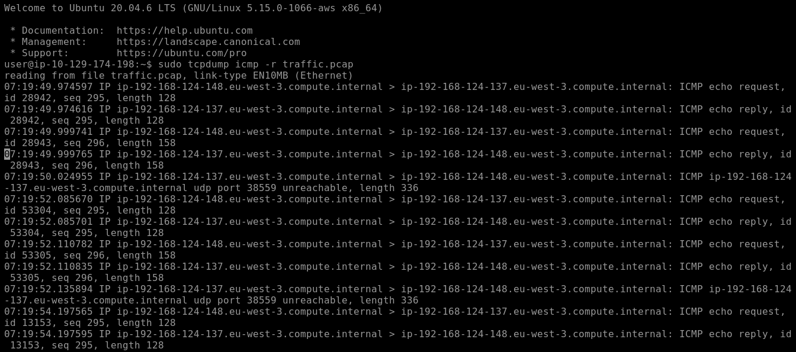
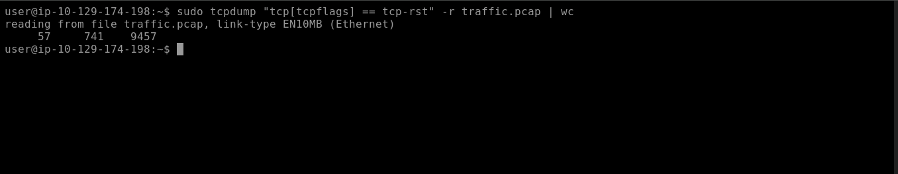
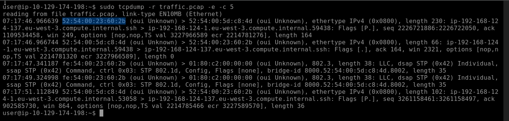
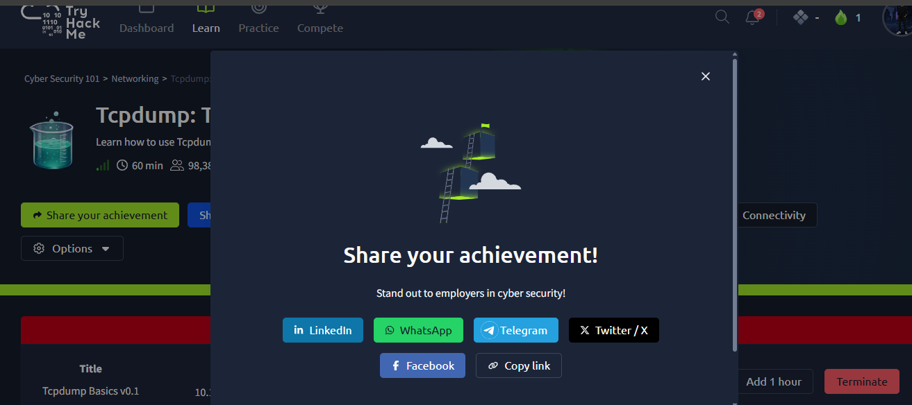

# 📡 TCPDump: The Basics

> **Room:** [TCPDump: The Basics](https://tryhackme.com/room/tcpdump)  
> **Difficulty:** Easy  
> **Pathway:** Cybersecurity 101  
> **Date Completed:** 9/06/2026  
> **Category:** Networking  

---

## 📚 Learning Objectives

By the end of this room, I aimed to understand:
- [x] What TCPDump is and how it relates to `libpcap`
- [x] How to capture packets and save them to a file
- [x] How to set filters on captured packets
- [x] How to control how captured packets are displayed
- [x] Basic packet capture commands and options
- [x] Filtering expressions for protocol-specific traffic
- [x] Advanced filtering using header bytes and TCP flags
- [x] Display options for packet analysis

---

## 🧠 Theory & Key Concepts

### What is TCPDump?
TCPDump is a powerful command-line packet analyzer and network traffic capture tool. It allows you to:
- Capture and inspect network packets in real-time
- Save packet captures to files for later analysis
- Apply filters to focus on specific traffic types
- Display packet data in various formats for analysis

### TCPDump and libpcap
TCPDump is built on top of the **`libpcap`** library, which provides the low-level packet capture functionality. `libpcap` was originally developed for Unix-like systems and has been ported to Windows as `WinPcap`/`Npcap`. Many other networking tools (including Wireshark) also rely on `libpcap` for packet capture.

| Component | Description |
|-----------|-------------|
| **TCPDump** | Command-line tool for capturing and analyzing packets |
| **libpcap** | The underlying C/C++ library that enables packet capture |
| **WinPcap/Npcap** | Windows port of libpcap |

### Why TCPDump Matters in Cybersecurity
| Role | Use Case |
|------|----------|
| **SOC Analyst** | Investigate network anomalies and suspicious traffic patterns |
| **Incident Responder** | Capture evidence during active security incidents |
| **Penetration Tester** | Verify successful exploits by observing network traffic |
| **Network Engineer** | Troubleshoot connectivity and performance issues |
| **Forensics Analyst** | Analyze PCAP files for evidence of malicious activity |

### TCPDump vs Wireshark
| Feature | TCPDump | Wireshark |
|---------|---------|-----------|
| Interface | Command-line | GUI |
| Resource Usage | Lightweight, minimal | Heavier, more resources |
| Best For | Remote servers, scripting, automation | Deep packet inspection, visual analysis |
| Speed | Fast, efficient | Slower on large captures |
| Learning Curve | Steeper (commands) | Gentler (point-and-click) |

**Key Insight:** TCPDump is often the go-to tool on remote systems where GUI tools aren't available (e.g., headless servers, SSH sessions). It's also faster for quick captures and can be easily scripted.

---

## 🖥️ Practical Walkthrough

### Task 1: Introduction

**Objective:** Understand TCPDump, its library association, and the room setup.

**What I Did:**
- Read the room introduction
- Started the virtual machine provided by TryHackMe
- Verified TCPDump installation:

```bash
tcpdump --version
```

**Key Concepts Learned:**
- TCPDump uses the **`libpcap`** library for packet capture
- The room provides an SSH-accessible VM with pre-installed tools
- SSH credentials: `user` / `THM123`

**Screenshot:**
> 
> *Confirming TCPDump and libpcap versions*

**Key Takeaway:** TCPDump and `libpcap` are foundational tools in networking. Understanding their relationship helps when troubleshooting capture issues or working with other tools that depend on the same library.

---

### Task 2: Basic Packet Capture

**Objective:** Learn fundamental TCPDump commands for capturing packets.

**What I Did:**

1. **Capture packets on a specific interface:**
```bash
sudo tcpdump -i eth0
```
- `-i eth0`: Listen on the `eth0` interface
- Without `-i`, TCPDump uses the first available interface

2. **Capture a limited number of packets:**
```bash
sudo tcpdump -i eth0 -c 10
```
- `-c 10`: Capture only 10 packets then stop

3. **Display addresses in numeric format only:**
```bash
sudo tcpdump -i eth0 -n
```
- `-n`: Don't resolve hostnames (shows IP addresses instead of domain names)
- `-nn`: Don't resolve hostnames OR port names (shows port numbers instead of service names like "http")

4. **Write captured packets to a file:**
```bash
sudo tcpdump -i eth0 -w capture.pcap
```
- `-w capture.pcap`: Save raw packets to `capture.pcap` for later analysis

5. **Read packets from a file:**
```bash
tcpdump -r capture.pcap
```
- `-r capture.pcap`: Read and display packets from a previously saved capture file

6. **Capture with verbose output:**
```bash
sudo tcpdump -i eth0 -v
```
- `-v`: Verbose output (more details)
- `-vv`: More verbose
- `-vvv`: Maximum verbosity

**Screenshot:**
> 
> *Running a basic capture on eth0 interface*

**Key Takeaway:** The `-n` flag is essential for performance — DNS resolution can significantly slow down captures. Always use `-w` to save captures; you can't retroactively analyze traffic you didn't save.

---

### Task 3: Filtering Expressions

**Objective:** Learn how to filter captured traffic using expressions.

**What I Did:**

1. **Filter by protocol:**
```bash
sudo tcpdump -i eth0 icmp
tcpdump -r traffic.pcap icmp
```
- Filters to show only ICMP (ping) packets

2. **Filter by host (IP address):**
```bash
sudo tcpdump -i eth0 host 192.168.1.1
```
- Shows traffic to or from `192.168.1.1`

3. **Filter by source host:**
```bash
sudo tcpdump -i eth0 src host 192.168.1.1
```

4. **Filter by destination host:**
```bash
sudo tcpdump -i eth0 dst host 192.168.1.1
```

5. **Filter by port:**
```bash
sudo tcpdump -i eth0 port 80
sudo tcpdump -i eth0 port 22
```

6. **Filter by source/destination port:**
```bash
sudo tcpdump -i eth0 src port 443
sudo tcpdump -i eth0 dst port 53
```

7. **Filter by network (CIDR):**
```bash
sudo tcpdump -i eth0 net 192.168.1.0/24
```

8. **Filter by MAC address:**
```bash
sudo tcpdump -i eth0 ether host aa:bb:cc:dd:ee:ff
```

9. **Combine filters with AND (`and` or `&&`):**
```bash
sudo tcpdump -i eth0 host 192.168.1.1 and port 80
```

10. **Combine filters with OR (`or` or `||`):**
```bash
sudo tcpdump -i eth0 port 80 or port 443
```

11. **Negate a filter (`not` or `!`):**
```bash
sudo tcpdump -i eth0 not port 22
```

12. **Group filters with parentheses:**
```bash
sudo tcpdump -i eth0 '(host 192.168.1.1 or host 192.168.1.2) and port 80'
```

**Analyzing the provided PCAP file:**
```bash
tcpdump -r traffic.pcap icmp | wc -l
```
- Count ICMP packets in the capture file

```bash
tcpdump -r traffic.pcap arp
```
- View ARP packets to find who asked for a specific MAC address

```bash
tcpdump -r traffic.pcap port 53
```
- View DNS traffic (port 53)

**Screenshot:**
> 
> *Filtering for ICMP packets in the traffic.pcap file*

**Key Takeaway:** TCPDump's filtering syntax is powerful and follows Berkeley Packet Filter (BPF) syntax. Mastering these filters is essential for focusing on relevant traffic and avoiding information overload.

---

### Task 4: Advanced Filtering

**Objective:** Use advanced filtering techniques based on protocol header bytes and TCP flags.

**What I Did:**

#### Understanding Header Byte Filtering
TCPDump allows filtering based on the contents of protocol header bytes using the syntax:
```
proto[expr:size]
```
- `proto`: Protocol (`arp`, `ether`, `icmp`, `ip`, `tcp`, `udp`)
- `expr`: Byte offset (0 = first byte)
- `size`: Number of bytes (1, 2, or 4; default is 1)

#### Common Advanced Filters

1. **Filter multicast Ethernet traffic:**
```bash
sudo tcpdump -i eth0 'ether[0] & 1 != 0'
```
- Checks if the least significant bit of the first byte is set (multicast)

2. **Filter IP packets with options:**
```bash
sudo tcpdump -i eth0 'ip[0] & 0xf != 5'
```
- Normal IP header is 20 bytes (5 * 4); this catches packets with IP options

3. **Filter TCP packets with specific flags:**

**Filter for SYN packets only:**
```bash
sudo tcpdump -i eth0 'tcp[13] & 2 != 0 and tcp[13] & 16 == 0'
```
- SYN is set (2) AND ACK is NOT set (0)

**Filter for RST packets only:**
```bash
sudo tcpdump -i eth0 'tcp[13] & 4 != 0 and tcp[13] & 2 == 0 and tcp[13] & 16 == 0'
```
- RST is set (4), SYN and ACK are NOT set

**Filter for packets larger than a certain size:**
```bash
sudo tcpdump -i eth0 'greater 15000'
```
- Shows packets with total length greater than 15,000 bytes

**Analyzing the PCAP with advanced filters:**
```bash
tcpdump -r traffic.pcap 'tcp[13] & 4 != 0 and tcp[13] & 2 == 0 and tcp[13] & 16 == 0' | wc -l
```
- Count packets with only RST flag set

```bash
tcpdump -r traffic.pcap 'greater 15000'
```
- Find packets larger than 15,000 bytes and identify the source IP

**Screenshot:**
> 
> *Filtering for TCP RST flag packets using header byte syntax*

**Key Takeaway:** Advanced filtering using header bytes is incredibly powerful for detecting specific network behaviors (e.g., port scans show SYN packets without ACK, connection resets show RST flags). This is fundamental knowledge for SOC analysts investigating suspicious traffic.

---

### Task 5: Displaying Packets

**Objective:** Learn how to control how captured packets are displayed.

**What I Did:**

1. **Basic display (default):**
```bash
tcpdump -r capture.pcap
```

2. **Display packet contents in hex and ASCII:**
```bash
tcpdump -X -r capture.pcap
```
- `-X`: Print each packet in hex and ASCII

3. **Display packet contents in hex only:**
```bash
tcpdump -x -r capture.pcap
```

4. **Display link-level header:**
```bash
tcpdump -e -r capture.pcap
```
- `-e`: Print the link-level header (shows MAC addresses)

5. **Display absolute sequence numbers:**
```bash
tcpdump -S -r capture.pcap
```
- `-S`: Print absolute TCP sequence numbers instead of relative ones

6. **Limit packet capture size (snaplen):**
```bash
sudo tcpdump -i eth0 -s 96
```
- `-s 96`: Capture only the first 96 bytes of each packet (header only)
- `-s 0`: Capture entire packet (default on most modern systems)

7. **Quiet output (less protocol info):**
```bash
tcpdump -q -r capture.pcap
```

**Analyzing ARP requests with display options:**
```bash
tcpdump -r traffic.pcap -e arp
```
- Shows MAC addresses of hosts sending ARP requests

**Screenshot:**
> 
> *Using -e flag to display link-level headers and MAC addresses*

**Key Takeaway:** Display options are crucial for different analysis scenarios. Use `-e` for MAC address analysis and `-X` for payload inspection

---

## 🏁 Room Completion & Flag

**Status:** ✅ Completed  
**Final Flag:** `THM{...}` *(Redacted — Please, complete the room yourself! You can do it!!)*

**Screenshot:**
> 
> *Proof of room completion from TryHackMe*

---

## 📝 Commands Reference

### Essential TCPDump Commands

```bash
# Basic Capture
sudo tcpdump -i eth0                           # Capture on eth0
sudo tcpdump -i any                          # Capture on all interfaces
sudo tcpdump -c 100                          # Capture 100 packets and stop
sudo tcpdump -w capture.pcap                   # Save to file

# Reading Captures
tcpdump -r capture.pcap                      # Read from file
tcpdump -r capture.pcap -c 50                # Read first 50 packets

# Display Options
sudo tcpdump -n                              # No DNS resolution
sudo tcpdump -nn                             # No DNS or port resolution
sudo tcpdump -v                              # Verbose
sudo tcpdump -vv                             # More verbose
sudo tcpdump -vvv                            # Maximum verbosity
sudo tcpdump -e                              # Show link-level headers (MAC)
sudo tcpdump -X                              # Hex and ASCII output
sudo tcpdump -XX                             # Hex/ASCII including link header
sudo tcpdump -S                              # Absolute TCP sequence numbers
sudo tcpdump -tttt                           # Full date/time timestamps

# Protocol Filters
sudo tcpdump icmp                            # ICMP (ping) traffic
sudo tcpdump tcp                             # TCP traffic only
sudo tcpdump udp                             # UDP traffic only
sudo tcpdump arp                             # ARP traffic

# Host & Port Filters
sudo tcpdump host 192.168.1.1                # Traffic to/from host
sudo tcpdump src host 192.168.1.1            # Traffic from source
sudo tcpdump dst host 192.168.1.1            # Traffic to destination
sudo tcpdump port 80                         # Traffic on port 80
sudo tcpdump src port 443                    # Traffic from source port
sudo tcpdump dst port 53                     # Traffic to destination port
sudo tcpdump portrange 1-1024                # Traffic on ports 1-1024

# Network Filters
sudo tcpdump net 192.168.1.0/24              # Traffic in subnet
sudo tcpdump src net 10.0.0.0/8              # Traffic from source network

# MAC Address Filters
sudo tcpdump ether host aa:bb:cc:dd:ee:ff    # Traffic to/from MAC
sudo tcpdump ether src host aa:bb:cc:dd:ee:ff # Traffic from MAC

# Combined Filters
sudo tcpdump host 192.168.1.1 and port 80    # AND condition
sudo tcpdump port 80 or port 443             # OR condition
sudo tcpdump not port 22                     # Exclude SSH
sudo tcpdump 'host 192.168.1.1 and (port 80 or port 443)'

# Advanced Filters (Header Bytes)
# TCP flags at byte 13: FIN=1, SYN=2, RST=4, PSH=8, ACK=16, URG=32
sudo tcpdump 'tcp[13] & 2 != 0'              # SYN packets
sudo tcpdump 'tcp[13] & 2 != 0 and tcp[13] & 16 == 0'  # SYN only (no ACK)
sudo tcpdump 'tcp[13] & 4 != 0'              # RST packets
sudo tcpdump 'tcp[13] & 1 != 0'              # FIN packets
sudo tcpdump 'tcp[13] = 18'                  # SYN-ACK only (2+16)

# Packet Size Filters
sudo tcpdump greater 100                       # Packets > 100 bytes
sudo tcpdump less 500                          # Packets < 500 bytes
sudo tcpdump 'greater 100 and less 500'      # Size range

# Useful Combinations
sudo tcpdump -i eth0 -nn -c 100 -w capture.pcap  # Quick save
sudo tcpdump -r capture.pcap -nn -X | less     # Inspect with pager
sudo tcpdump -r capture.pcap -nn 'tcp[13] & 2 != 0 and tcp[13] & 16 == 0'  # Find SYN scans
```

---

## 💡 Key Takeaways & Lessons Learned

1. **TCPDump is essential for headless environments** — Unlike Wireshark, TCPDump works on any system with a terminal, making it indispensable for remote server analysis and incident response.

2. **Always save your captures with `-w`** — You can analyze saved PCAP files later with TCPDump, Wireshark, or other tools. Real-time traffic is gone forever once the packet passes.

3. **Use `-n` for performance** — DNS resolution during capture can slow things down significantly and generate additional DNS traffic that pollutes your capture.

4. **TCP flags are your friend** — Understanding how to filter by TCP flags (`tcp[13]`) is crucial for detecting scans, identifying connection states, and troubleshooting network issues.

5. **Combine filters strategically** — Use `and`, `or`, and `not` to build precise filters. Parentheses help group complex conditions.

6. **Less is more with snaplen** — Use `-s` to limit captured bytes when you only need headers, reducing file size and processing time.

7. **Permission is paramount** — Packet capture requires root privileges. Never capture traffic on networks you don't own or have explicit authorization to monitor.

---

## 🔗 Additional Resources

- [TCPDump Official Documentation](https://www.tcpdump.org/manpages/tcpdump.1.html)
- [TCPDump Cheat Sheet](https://www.stationx.net/tcpdump-cheat-sheet/)
- [TryHackMe TCPDump Room](https://tryhackme.com/room/tcpdump)
- [Wireshark: The Basics (THM)](https://tryhackme.com/room/wiresharkthebasics) — Great companion room to learn as well

---

*Write-up by: Precious Ajibola*  
*Date: 09/06/2026*  
*Next Module: Nmap:The Basics*

